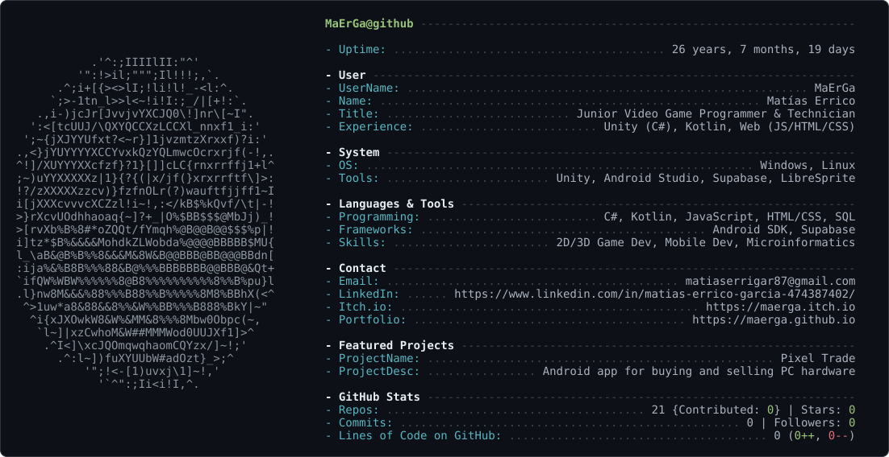

<!--
  The SVGs below are generated. Edit config.yaml (content), render.py (layout
  or palette), or ascii_art.py (the portrait) - never the .svg files directly,
  they are overwritten on every workflow run.

  Layout and concept after Andrew Grant (@Andrew6rant). See CREDITS.md.
-->

<picture>
  <source media="(prefers-color-scheme: dark)" srcset="dark_mode.svg">
  <source media="(prefers-color-scheme: light)" srcset="light_mode.svg">
  
</picture>
